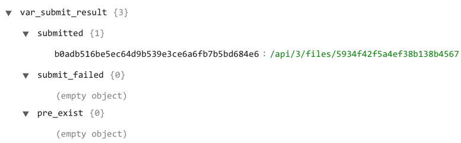
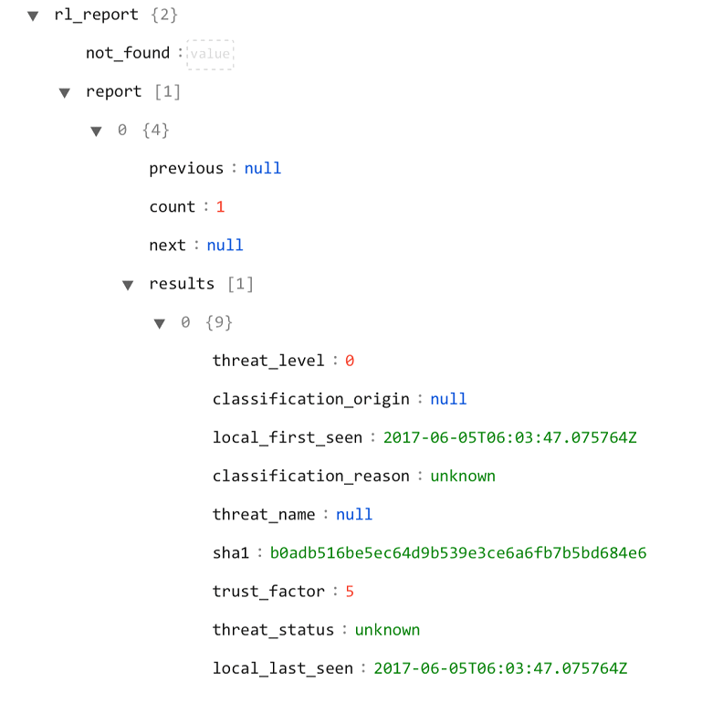
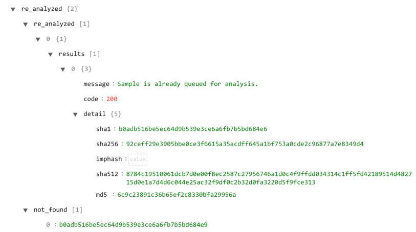

## About the connector
ReversingLabs A1000 performs the ReversingLabs Hashing Algorithm (`RHA`) functional similarity analysis on each file, which determines whether the analyzed sample is like previously seen malware or goodware. ReversingLabs A1000 identifies malformed files or files with known malicious characteristics by using multiple threat classification methods. This provides a complete and powerful static/dynamic analysis solution. 

This document provides information about the ReversingLabs A1000 connector, which facilitates automated interactions, with a ReversingLabs A1000 server using CyOPs™ playbooks. Add the ReversingLabs A1000 connector as a step in CyOPs™ playbooks and perform automated operations, such as uploading samples for analysis and retrieving reports for the submitted sample.

### Version information
Connector Version: 1.0.0

Compatibility with CyOPs™ Versions: 4.9.0.0-662 and later

Compatibility with ReversingLabs A1000 Versions: 3.5.0.0 and later

## Installing the connector

All connectors provided by  CyOPs™ are delivered using a CyOPs™ repository. Therefore, you must set up your CyOPs™ repository and use the `yum` command to install connectors:

`yum install cyops-connector-reversinglabsa1000`

To update a  CyOPs™-provided connector use the following command:

`yum update cyops-connector-reversinglabsa1000`

To remove a  CyOPs™-provided connector use the following command:

`yum remove cyops-connector-reversinglabsa1000`

The process to write your own custom connector is defined in the `Building a custom connector` topic.

## Prerequisites to configuring the connector

- You must have the URL of ReversingLabs A1000 server to which you will connect and perform the automated operations and credentials to access that URL.
- To access the CyOPs™ UI, ensure that port 443 is open through the firewall for the CyOPs™ instance.

## Configuring the connector

1. In CyOPs™, on the left pane, click **Connectors**.  
   On the `Connectors` page, you will see the `ReversingLabsA1000 ` connector.
2. Click **Configure** to configure the connector parameters.  
   The configuration parameters that you must provide is the URL of the ReversingLabs A1000 server and the user name and password to access the ReversingLabs A1000 endpoint.  
   For more information, see the [Configuration parameters](#Configuration-parameters) section.  
   **Note**: You can add multiple configurations if you have more than one ReversingLabs A1000 instances in your environment. You must, therefore, specify a unique `Name` to identify each configuration in your environment.  
   If you have previous versions of a connector and you are configuring a newer version of that connector, with the same configuration parameters, then CyOPs™ fetches the configuration and input parameters of the latest available version of that connector. For example, If you have 1.0.0, 1.1.0, and 1.2.0 versions of the ReversingLabs A1000 connector and you are configuring the 1.3.0 version of the ReversingLabs A1000 connector, then while configuring the 1.3.0 version,  CyOPs™ will fetch the configuration and input parameters from the 1.2.0 version of the ReversingLabs A1000 connector. You can review the configuration and input parameters, and then decide to change them or leave them unchanged. 
3. Click **Next**.
4. Choose the actions that you want to enable or disable using the slider in the Status column, **Enabled** or **Disabled**, based on the automated operations you want the ReversingLabs A1000 connector to perform.
5. Click **Update**.  
   Once you click **Update**, the ReversingLabs A1000 connector performs a health check, to check the following:  
   Connectivity to the URL of the ReversingLabs A1000 endpoint.  
   Validity of the credentials provided.  
   If all the details are correct and the connectivity to the ReversingLabs A1000 endpoint is established then on the `Connectors` page, **Available** is displayed in the `ReversingLabsA1000 Connector: Configuration Step 1 of 2` dialog.  
   If any or all the details are incorrect or if the connectivity to the ReversingLabs A1000 endpoint cannot be established then on the `Connectors` page, **Disconnected** is displayed in the `ReversingLabsA1000 Connector: Configuration Step 1 of 2` dialog.  
   You can also click the **Refresh** icon to perform a health check at any time. 

You can view the playbooks bundled with the connector. Refer to the [Included Playbooks](#Included-playbooks) section for details on the bundled playbooks. You can see the bundled playbooks in the **Orchestration and Playbooks** section in CyOPs™ after importing the ReversingLabs A1000 connector.

### Configuration parameters

In CyOPs™, on the Connectors page, select the **ReversingLabs A1000** connector and click **Configure** to configure the following  parameters:

| Parameter | Description                              |
| --------- | ---------------------------------------- |
| Server    | URL of the endpoint for the ReversingLabs A1000 server to which you will connect and perform the automated operations. |
| Username  | Username to access the ReversingLabs A1000 endpoint. |
| Password  | Password to access the ReversingLabs A1000 endpoint. |

**Note**: You can store the passwords and other confidential data using the `Secrets` store provided in CyOPs™. When you store data in the `Secrets` store, users cannot see that data. However, they can use this data when required. For more information about the `Secrets` store, see "Configuring the Secrets store" in the "Administration" guide.

## Actions supported by the connector

The following automated operations can be included in playbooks:

- Upload Sample: Uploads a sample file to ReversingLabs A1000 for analysis.
- Get Report using File Hash: Retrieves a report from ReversingLabs A1000 for the sample that you have submitted based on the SHA1 of the sample.
- Re-analyze Sample using File Hash:  Requests ReversingLabs A1000 to re-analyze a previously submitted sample based on the SHA1 of the previously submitted sample.

### operation: Upload Sample

#### Input parameters

**Notes**:

- Using this operation, you submit files available in CyOPs™, in the 'Attachments' module to ReversingLabs A1000. You can select multiple fields to be submitted to ReversingLabs A1000 for Malware analysis.
- You must ensure that the custom `fileHash` field is available in the CyOps™ `Attachments` module. The `fileHash` field holds a ReversingLabs A1000 return value, which is the SHA1 of submitted sample. Use the SHA1 value when you want to retrieve the report from ReversingLabs A1000. Updates to the `Attachment` module to add the SHA1 of a sample is achieved using CyOPs™ Playbooks.

| Parameter | Description                              |
| --------- | ---------------------------------------- |
| File IRI  | List of File IRI. File IRI used to access the file directly from the CyOPs™  Attachments module   In the playbook, this defaults to the `{{vars.file_iri_list}}` value. |

#### Output

The JSON output contains the following:

- The `submitted` parameter of the JSON object in case of success, contains file hash as keys and the values as file iri of the submitted files from CyOps™ (`Attachments` Module).

- The `submit_failed` parameter of the JSON object in case of failure, contains file hash as keys and the values as file iri of the submitted files from CyOps™.
- The `pre_exist` parameter of the JSON object in case of success contains file hash as keys and the values as file iri of existing samples on ReversingLabs A1000 server.

Following image displays a sample output:

### operation: Get Report using File Hash

#### Input parameters

| Parameter | Description                              |
| --------- | ---------------------------------------- |
| File Hash | Single file hash or a list of file hash based on which you want to retrieve a report from ReversingLabs A1000. |

#### Output

A JSON output containing the report from ReversingLabs A1000 for a sample based on the specified file hash or SHA1 of the sample.

**Note**: The `not_found` parameter of the JSON object contains a list of file hash for a sample that is not found on the ReversingLabs A1000 server.

Following image displays a sample output:

### operation: Re-analyze Sample using File Hash

#### Input parameters

| Parameter | Description                              |
| --------- | ---------------------------------------- |
| File Hash | Single file hash or a list of file hash based on which you want to request ReversingLabs A1000 to reanalyze a previously submitted sample. |

#### Output

The JSON contains the report from ReversingLabs A1000 for a sample that has been reanalyzed based on the specified file hash or SHA1 of the previously submitted sample.

**Note**: The `not_found` parameter of the JSON object contains a list of file hash for a sample that is not found on the ReversingLabs A1000 server.

Following image displays a sample output:

## Included playbooks

The following playbooks come bundled with the ReversingLabs A1000 connector. These playbooks contain steps using which you can perform all supported actions. You can see the bundled playbooks in the **Orchestration and Playbooks** section in  CyOPs™ after importing the ReversingLabs A1000 connector.

- Submit Sample to RL A1000 
- Get report using file hash from RL A1000
- Re-analyzed Sample using RL A1000
- Update attachment with file hash
- Update attachment with reversingLabs report data

